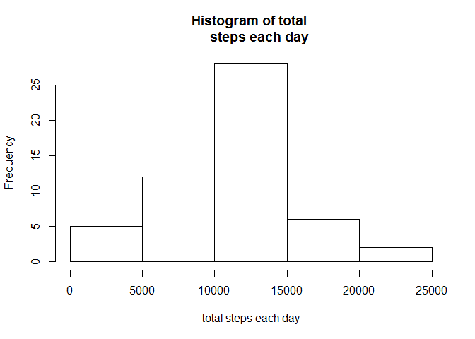
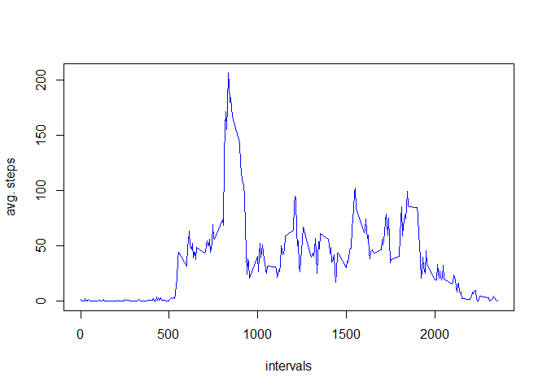
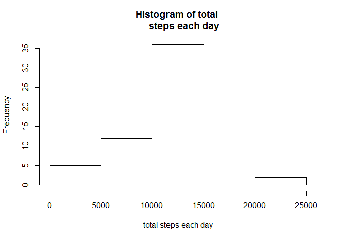
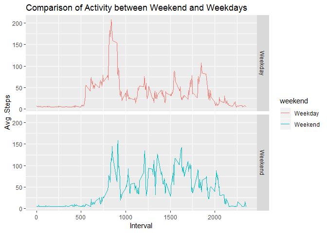

## Loading and preprocessing the data

```r
library(Hmisc)
```

```
## Loading required package: lattice
```

```
## Loading required package: survival
```

```
## Loading required package: Formula
```

```
## Loading required package: ggplot2
```

```
## Registered S3 methods overwritten by 'ggplot2':
##   method         from 
##   [.quosures     rlang
##   c.quosures     rlang
##   print.quosures rlang
```

```
## 
## Attaching package: 'Hmisc'
```

```
## The following objects are masked from 'package:base':
## 
##     format.pval, units
```

```r
library(dplyr)
```

```
## 
## Attaching package: 'dplyr'
```

```
## The following objects are masked from 'package:Hmisc':
## 
##     src, summarize
```

```
## The following objects are masked from 'package:stats':
## 
##     filter, lag
```

```
## The following objects are masked from 'package:base':
## 
##     intersect, setdiff, setequal, union
```

```r
library(ggplot2)
download.file("https://d396qusza40orc.cloudfront.net/repdata%2Fdata%2Factivity.zip", destfile = "activity.zip", mode="wb")
# unzip data and read 
unzip("activity.zip")
data <- read.csv("activity.csv", header = TRUE)

str(data)
```

```
## 'data.frame':	17568 obs. of  3 variables:
##  $ steps   : int  NA NA NA NA NA NA NA NA NA NA ...
##  $ date    : Factor w/ 61 levels "2012-10-01","2012-10-02",..: 1 1 1 1 1 1 1 1 1 1 ...
##  $ interval: int  0 5 10 15 20 25 30 35 40 45 ...
```

```r
head(data)
```

```
##   steps       date interval
## 1    NA 2012-10-01        0
## 2    NA 2012-10-01        5
## 3    NA 2012-10-01       10
## 4    NA 2012-10-01       15
## 5    NA 2012-10-01       20
## 6    NA 2012-10-01       25
```

```r
data$date <- as.Date(data$date)
data1 <- na.omit(data)
steps <- aggregate(data1$steps, by = list(Date = data1$date), FUN = sum)
colnames(steps) <- c("day", "steps")
```


## What is mean total number of steps taken per day?

```r
mean(steps$steps)
```

```
## [1] 10766.19
```

```r
median(steps$steps)
```

```
## [1] 10765
```
#####Histogram of the total number of steps taken each day

```r
hist(steps$steps, xlab ="total steps each day", main ="Histogram of total 
     steps each day")
```

<!-- -->

## What is the average daily activity pattern?

```r
interval <- aggregate(data1$steps, by = list(data1$interval), FUN =mean)
colnames(interval ) <- c("interval", "steps")
```
##### Time series plot of 5 min intervals

```r
plot(interval$interval, interval$steps, type ="l",
         col ="blue", xlab ="intervals" , ylab ="avg. steps")
```

<!-- -->

```r
interval[which(interval$steps== max(interval$steps)),]
```

```
##     interval    steps
## 104      835 206.1698
```

## Imputing missing values

```r
sum(is.na(data))
```

```
## [1] 2304
```

```r
imputed_data <- data
imputed_data$steps<- impute(data$steps, fun=mean)
imputed_steps <- aggregate(imputed_data$steps, by = list(Date = imputed_data$date), FUN = sum)
colnames(imputed_steps) <- c("day", "steps")
```
#####  Histogram of the total number of steps taken each day in imputed data 

```r
hist(imputed_steps$steps, xlab ="total steps each day", main ="Histogram of total 
     steps each day")
```

<!-- -->
##### MEan and meadian of steps

```r
mean(imputed_steps$steps)
```

```
## [1] 10766.19
```

```r
median(imputed_steps$steps)
```

```
## [1] 10766.19
```
## Are there differences in activity patterns between weekdays and weekends?

```r
imputed_data$day <- weekdays(imputed_data$date)
imputed_data$day<- ifelse(imputed_data$day=="Saturday" | imputed_data$day=="Sunday", "Weekend", "Weekday" )


imputed_data_day <- aggregate(imputed_data$steps , by= list(imputed_data$day, imputed_data$interval), FUN = mean)
names(imputed_data_day) <- c("weekend", "interval", "steps")
```
##### 2. Panel plot containing a time series plot

```r
ggplot(imputed_data_day, aes(x=interval, y=steps, color=weekend)) + geom_line()+
        facet_grid(weekend ~.) + xlab("Interval") + ylab(" Avg .Steps") +
        ggtitle("Comparison of Activity between Weekend and Weekdays")
```

<!-- -->

